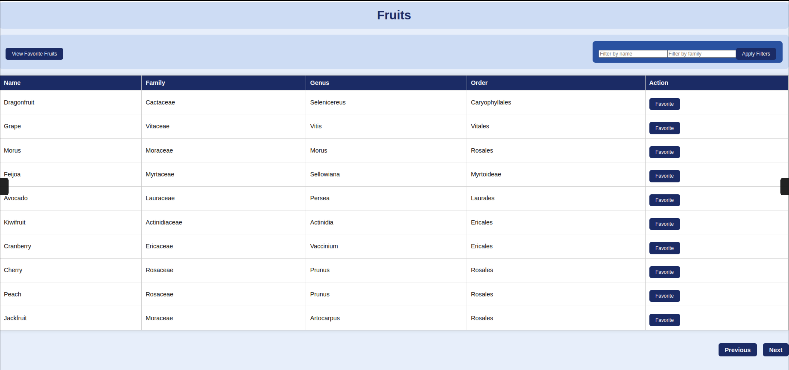
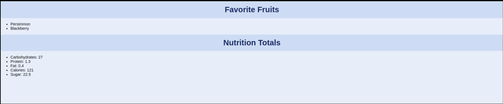

**System requirements**

- Operating System:  Linux OR Windows OS
- PHP Version: 8.1+
- Technologies : Laravel and Vue Js

**Setup Instructions**

1. Clone the Project Repository
- git clone https:...

2. Go to your project directory
   cd /path to project directory

3. Configure the mysql connections in .env file
   DB_DATABASE
   DB_USERNAME
   DB_PASSWORD

4. RUN docker-compose up --build

5. RUN docker exec -it fruit-app php artisan fruits:fetch

**Usage**

- link http://127.0.0.1:8000/dashboard

- User will see list of all fruits with maximum 10 fruits in one page.

- User can add each fruit as favourite fruits and can see list of all favourite fruits with sum of nutritions facts of favourite fruits.
  
